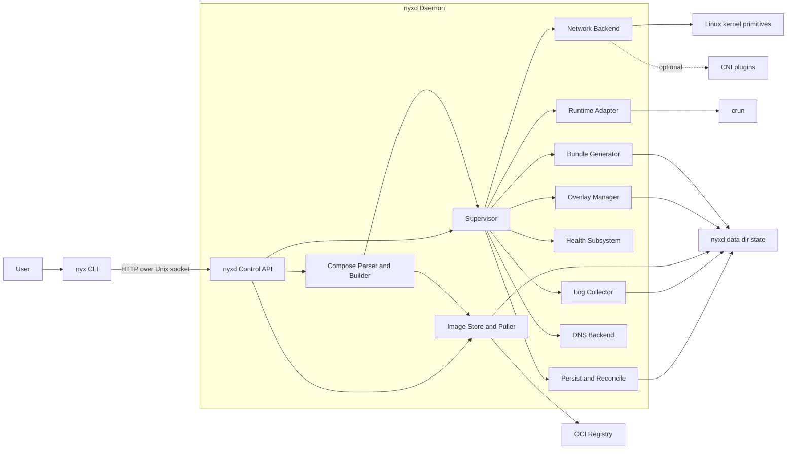

# nyxd roadmap

Legend: `[x]` shipped in tree (still may need polish), `[ ]` not done, `[~]` partial / risky.

---

## Architecture diagram

## Already in the tree (high level)

- [x] **OCI runtime shell-out** — `internal/runtime`: `crun` create/start/run (`--detach` helper), **`run` foreground** (`--pid-file` + stdio), kill/delete/state/list, **`CrunContainerAbsent`** (missing `status` / not-found) for wait/teardown, idempotent **`Delete`** when state already gone, state JSON parsing, dedicated `--root` state dir.
- [x] **Supervisor skeleton** — `internal/supervisor`: `Start` / `Stop` / `Kill` / `Remove` / `Shutdown`, restart policies, overlay + **network.Backend** setup + `bundle.Generate` + **`crun run` foreground** (stdio → log collector) with **`resetLogIO`** + **`waitStoppedOrForceDelete`** on stop/kill (missing OCI state tolerated; **`ListInfo`** can show **`absent`**), supervised restart loop with backoff + jitter. **On-disk JSON** under `{baseDir}/supervisor/containers/*.json` plus **`bundles/<id>/nyxd-meta.json`** re-seed **`nyx ps`** after an unclean restart when crun is still **running** (JSON first, then bundle meta + image resolve; no Bolt/SQLite KV).
- [x] **Image pull (registry v2)** — `internal/image`: `Store`, anonymous token auth, manifest (+ index) fetch with configurable platform (`Store.SetPlatform`, `nyxd -pull-platform`), concurrent layer download with digest verify, atomic blob writes, resumable layer fetch (`.partial` + HTTP Range), `ParseRef`, `LoadImageMeta`, `LoadManifest`, unreferenced blob prune after `RemoveImage`.
- [x] **CNI exec path (optional)** — `internal/network`: when **`-net-driver=cni`**, conflist generation, `EnsureNetwork`, `Setup`/`Teardown` via plugin exec, netns under `/run/nyxd/netns`, portable `detachUnmount` for teardown. Default daemon mode uses **native** (no `/opt/cni/bin`).
- [x] **Bundle / OCI config** — `internal/bundle`: `config.json` generation with default caps, masked paths, `noNewPrivileges`, cgroup resource mapping, **optional `ExtraMounts`** merged after default mounts.
- [x] **Compose subset** — `internal/compose`: real YAML (`gopkg.in/yaml.v3`), image/restart validation, unknown `depends_on` detection, cycle detection, `TopologicalOrder` helper, default `no_new_privileges=true` when unset.
- [x] **Healthcheck library** — `internal/health`: exec (via `crun exec` + `CommandContext`), HTTP, TCP, retries, `onUnhealthy` callback hook (caller must wire policy).
- [x] **Logs** — `internal/logs`: JSONL append per container, `Tail` (reads whole file — see gaps).
- [x] **Telemetry types** — `internal/telemetry`: counters + optional Prometheus-ish HTTP handler (`ServeMetrics`) — **not called from daemon today**.
- [x] **Daemon entry** — `cmd/nyxd`: wiring for store, overlay, **`network.Backend`** (`-net-driver` **native** default or **cni**), runtime, log collector, supervisor; graceful shutdown context (30s); root check; **Unix socket HTTP control API** (`-socket`, default `/run/nyxd/nyxd.sock`); startup log **`network backend`** / **`driver`**; `go.sum` maintained via `go mod tidy`.
- [x] **`nyx` CLI client** — `cmd/nyx`: `ping`, `version`, `pull` (streamed progress + summary by default, `--json` for single JSON; optional **`--username` / `--password`**), `run` (foreground: log follow + **Ctrl+C → `POST …/kill` SIGKILL**; `-d`/`--detach`), `ps`, `rm`, `stop`, `logs` (`-f` / `--tail`), `image ls` / `image rm` / **`image prune`** (`--dry-run`), `exec`, `container` aliases, **`nyx compose up|stop|down`** (compose file discovery, **`down -v`**); `make build-nyx` → `bin/nyx`.
- [x] **Unit tests** — compose parser, image ref parsing, native IPAM (Linux build); no end-to-end integration tests.
- [x] **Docs / packaging** — [documentation index](/docs/), **INSTALL** / **USAGE**, **OpenAPI**, [networking](/docs/operations/networking), kernel requirements, native network internals, QEMU Alpine guide, example service units (`Type=simple` in `packaging/nyxd.service`, `Type=notify` in repo `nyxd.service` without `sd_notify` yet).

---

## Runtime / crun

- [ ] **Zero-latency exit wait** — `WaitForExit` still polls `crun state` every 200ms; prefer `crun events --format json`, pidfd, or inotify on state dir where portable.
- [~] **Robust exit code** — prefers `exit_code` in state JSON when present, then `<root>/<id>/exit_code`, then a second raw JSON parse for alternate keys (`exitCode`, `exit_status`, …). Still no `crun delete` stdout fallback.
- [x] **`crun exec` for one-off commands** — `runtime.Runtime.Exec` + control route `POST /v1/containers/{id}/exec` + `nyx exec …`.

**Done / partial**

- [x] **Lifecycle via CLI** — create/start/run/kill/delete/state/list implemented around one `Runtime` type.
- [~] **WaitForExit** — works via polling; high latency vs event-driven.

---

## Supervisor

- [~] **Shutdown fairness** — each parallel `Stop` now wrapped in its own **45s** timeout (`Shutdown` context still shared); a hung `crun kill` no longer blocks others indefinitely, but there is no global “all must finish by T” budget beyond the caller’s `ctx`.
- [x] **Backoff jitter** — exponential backoff adds small random jitter (`math/rand/v2`) to reduce thundering herds.
- [x] **Ordered multi-start** — `supervisor.StartSequential` starts specs in slice order; **`compose.BuildContainerSpecs`** + **`POST /v1/compose/up`** + **`nyx compose up`** wire `TopologicalOrder` end-to-end.
- [x] **Readiness after `crun run`** — optional `ContainerSpec.Healthcheck`: `health.WaitReady` after the workload is running, before `Start` returns; then a background `health.Checker`.
- [x] **Unhealthy → restart** — checker `onUnhealthy` calls `KillForRestart` when `shouldRestart(..., exitCode=1)` allows it (`RestartNever` does not respawn on health alone).

**Done / partial**

- [x] **Restart policies** — always / on-failure / unless-stopped / never + `MaxRestarts` gate.
- [x] **Backoff between restarts** — exponential delay capped at 30s **with jitter** (`math/rand/v2`).
- [x] **`Healthcheck` on spec** — `ContainerSpec.Healthcheck` + optional `healthcheck` on `POST /v1/containers/run` JSON; normalized defaults via `health.Normalize`.

---

## Image puller

- [~] **Private / credentialed registries** — `PullWithProgress` accepts `RegistryAuth` (Basic + Bearer token flow); **`POST /v1/images/pull`** / **`POST /v1/containers/run`** / compose per-service `registry_username` / `registry_password`; **`nyx pull -u/--password`**. No `DOCKER_CONFIG` / OAuth refresh yet.
- [ ] **Image signature / policy enforcement** — no cosign / Notary-style verify-before-run; pulled blobs are digest-checked for transport integrity only.
- [ ] **Registry mirror for pulls** — no `HTTP_PROXY`-style mirror host or `--registry-mirror` for air-gapped or restricted-network pulls.
- [x] **Resume partial downloads** — incomplete layer/config fetch keeps `<blob>.partial` and resumes with `Range` when the registry returns `206`; falls back to full re-download if the server ignores ranges.
- [x] **Platform override** — index picks `wantOS`/`wantArch` from `Store.SetPlatform` or `runtime.GOOS`/`GOARCH`; `nyxd -pull-platform` sets the store.
- [x] **Garbage collection (blobs)** — `Store.PruneUnreferencedBlobs` removes `blobs/sha256/*` not referenced by any `images/**/manifest.json`; invoked from `RemoveImage` (therefore also during `PruneImagesNotIn` / image prune).
- [~] **`fetchBlob` return path** — layer pulls use **`fetchBlobToDisk`** (stream + verify + rename, no full-blob `ReadFile` after write). Small config blobs still use `fetchBlob` which re-reads from disk (acceptable size).

**Done / partial**

- [x] **Public pull + verify** — digest verify on write, atomic rename, bounded concurrency, 4MiB cap on manifest **response** body read (not full layer in RAM during copy).
- [x] **`ParseRef` / `LoadImageMeta` / `LoadManifest`** — for tooling and unpack helpers.
- [x] **`PullWithProgress` + streamed pull API** — `POST /v1/images/pull` with `{"stream":true}` returns **`application/x-ndjson`** (phase events + throttled byte progress); **`nyx pull`** uses it by default with progress UI + human summary; **`--json`** keeps the legacy single JSON body.
- [x] **Image prune** — `Store.PruneImagesNotIn`, **`POST /v1/images/prune`** (`dry_run`), **`nyx image prune`**; each removed image triggers blob prune for unreferenced digests.

---

## Overlay

- [x] **Safe tree walk + dedup cache** — overlay extraction uses `WalkDir`, skips symlink directory targets, whiteout path checks with `filepath.Rel`; per-digest extraction cache under `_cache/<sha256>/` with mutex.
- [x] **Layer deduplication (cross-image)** — shared `_cache/<digest>` for extracted layers.
- [~] **`extractTar` via host `tar`** — pragmatic but not all OCI whiteout variants (e.g. `.wh..wh..plnk` hardlink whiteouts) guaranteed; pure-Go or container-aware extractor still TBD.

**Done / partial**

- [x] **overlayfs mount lifecycle (Linux)** — lower/upper/work/merged layout, `Remove` unmount + cleanup; non-Linux stub returns clear error.

---

## Native network (`internal/network/native`)

- **Operator guide:** [networking](/docs/operations/networking) — `-net-driver`, `network.Backend`, `nyxd` vs `nyx`, systemd, CNI optional path.

### Design / internals

- [~] **`runNft` / `addPortMappings`** — uses `exec.Command` + `withTimeout` instead of `syscall.Exec` (daemon no longer loses the process). Rule syntax / nft availability may still fail at runtime; errors are logged.
- [x] **`ensureNftTable`** — initial table load uses `exec.Command("/usr/sbin/nft", "-f", file)` inside `sync.Once` (no `unix.Exec`).
- [x] **`withTimeout`** — used by `runNft` for each shell-out.
- [x] **`portmapState` / DNAT teardown** — nft rules tagged with a per-container comment prefix; **`removePortMappings`** deletes matching rules on teardown.
- [x] **IPAM bounds** — CIDR + gateway from **`NYXD_CONTAINER_SUBNET`** / **`NYXD_GATEWAY_IP`**; allocator walks the real prefix (non-`/16`-only).
- [ ] **IPv6** — IPv4-only assumptions throughout bridge + NAT.

**Done / partial**

- [x] **Linux-only in-process bridge + netlink RTNETLINK** — veth, bridge attach, basic IPAM file backend, tests for allocator on Linux.
- [x] **IPAM lazy init (CI / unprivileged)** — `getIPAM()` + **`NYXD_IPAM_DIR`**; falls back to **`$TMPDIR/nyxd-ipam`** when `/var/lib/nyxd/ipam` is not writable (no package-load panic).
- [x] **`!linux` stub** — builds on macOS/CI without native stack.

### Product gaps (call out in operator comparisons)

- [ ] **Embedded DNS / in-stack service discovery** — no in-daemon resolver; containers use image/host **`resolv.conf`** unless the workload sets DNS; **`cni`** mode would need an extra plugin (e.g. **`dnsname`**) in the conflist — not wired by default.
- [ ] **Multi-network / Compose network isolation** — **native** mode is effectively **one cluster-wide bridge** per daemon. Compose **`networks:`** is parsed but **not** mapped to separate bridges, subnets, or policy per logical network (per-network isolation in **native** mode is TBD).

---

## Compose parser

- [x] **Real YAML parsing** — `compose.Parse([]byte)` with `yaml.v3` (replaces old `parseYAML` stub narrative).
- [x] **`depends_on` at runtime** — **`ParseFile`** (`.env` + `${VAR}` substitution), **`BuildContainerSpecs`**, **`POST /v1/compose/up`**, **`nyx compose up`**; **`POST /v1/compose/stop`** / **`down`** + **`nyx compose stop|down`** (default compose filename order: see **`internal/compose/discover.go`** and [Usage](/docs/getting-started/usage)).
- [x] **Variable substitution** — `${VAR}`, `$VAR`, `${VAR:-default}`, `$$`; `.env` merged then overridden by process env (compose-spec order).
- [x] **Volume / bind mount model** — compose `volumes:` lines → **`ContainerSpec.ExtraMounts`** → **`bundle.Options.ExtraMounts`**; named volumes require a top-level **`volumes:`** entry; host dirs under **`{baseDir}/volumes/<project>/<name>/`**. **`compose down -v`** removes those dirs when **`supervisor.IsBindSourceInUse`** reports no remaining mount reference.

**Gaps**

- [ ] **Implicit named volumes** — Compose files that reference `name:/path` without a top-level `volumes:` entry for `name` are not treated as named volumes (bind semantics or parse error instead).
- [ ] **Standalone volume UX** — no `nyx volume ls` / `volume rm`; named volume lifecycle is **create-on-up** + **optional delete on `compose down -v`** only.
- [ ] **Compose `networks:` vs runtime** — YAML **`networks:`** / per-service **`networks:`** lists do not create isolated L2 domains or per-network DNS under **native**; see **Networking product gaps** above.

**Done / partial**

- [x] **Restart policy validation**, **cycle detection**, **unknown dependency errors**, **default `no_new_privileges`**.

---

## Health checks

- [x] **Supervisor integration** — readiness `WaitReady` + `Checker.Start` from `supervisor.Start` / re-adopt path; `KillForRestart` on sustained failure when restart policy allows.
- [~] **Exec hang** — `checkExec` uses `exec.CommandContext` with timeout ctx; still depends on crun honoring signals/cancellation.

**Done / partial**

- [x] **Checker implementation** — interval, timeout, retries, start period, HTTP/TCP/exec/`none`.

---

## Log collector

- [ ] **Rotation by size** — `Rotate` exists but no max-size trigger; growth unbounded.
- [ ] **`Tail` memory** — reads/decodes entire JSONL file then truncates to last *n* — unsafe for large logs.
- [x] **Follow mode (API + client)** — `GET /v1/containers/{id}/logs?follow=1&tail=…&plain=…` (daemon tails JSONL file); **`nyx logs -f`** / **`nyx container logs -f`**; foreground **`nyx run`** streams the same endpoint.
- [ ] **Alternate sinks** — JSONL to disk only; no syslog / journald forwarder interface.

**Done / partial**

- [x] **Stream from reader to JSONL file** — `Collector.Stream` with context cancellation.

---

## Telemetry

- [ ] **Wire-up** — `telemetry.New` / `ServeMetrics` never referenced from `cmd/nyxd` or supervisor; counters stay at zero. Intended to aggregate **cgroup + (future) eBPF** counters — see **eBPF** section.

**Done / partial**

- [x] **Package scaffold** — HTTP `/metrics` handler skeleton in `internal/telemetry`.

---

## eBPF (observability and networking)

**Goal:** use the kernel’s **eBPF** subsystem where it beats userspace polling or duplicate netfilter accounting — especially on **resource-constrained hosts** — and **coordinate with host-wide BPF policy** when the machine already runs signed, attested programs (shared BTF/CO-RE expectations, loader lifecycle, pinning conventions) so **nyxd** does not fork a second incompatible BPF stack on the same machine.

### Kernel / packaging assumptions

- [ ] **Document BPF prerequisites** — kernel **CONFIG_BPF**, **CONFIG_BPF_SYSCALL**, **CONFIG_DEBUG_INFO_BTF** (for CO-RE), and minimum versions for chosen program types; fail closed when BTF or permissions are missing.
- [ ] **Capability model** — `CAP_BPF` / `CAP_PERFMON` / locked memory (`ulimit -l`) and secure boot implications documented for operators.

### Networking (native path first)

- [ ] **Per-container traffic accounting** — byte/packet counters per **cgroup** or **netns** (tc `clsact` / cgroup skb hooks) exported for **Prometheus** or JSON status without scraping `/proc/net/dev` per veth.
- [ ] **Published-port flow visibility** — optional eBPF conntrack-adjacent or socket-level stats for **DNAT** paths that today rely on **nft** rules only (complements, not replaces, existing **`nft`** port maps).
- [ ] **DDoS / abuse rudiments (optional)** — rate-limit or SYN cookies at XDP for **host-facing** services on selected interfaces (strictly opt-in; not default).

### Observability beyond net

- [ ] **Scheduler / latency profiles (optional)** — `runqlat`-style programs for **run-queue latency** debugging when cgroup CPU throttling is suspected.
- [ ] **OOM / memcg visibility** — BPF tracepoints or ringbuf events for **memory pressure** correlated with container cgroup id (pairs with **Production hardening (soak / OOM)** below).

### Signed eBPF / host policy integration

- [ ] **Single loader / object policy** — where the site already uses a **signed BPF object** pipeline, reuse compatible **pinning paths**, **attach/detach** rules, and lifecycle tied to `nyxd` **supervisor** start/stop so programs are not orphaned across daemon restarts.
- [ ] **Attestation / policy gate (optional)** — allow only **operator-approved** eBPF objects when local policy requires it.

### API / product

- [ ] **Expose metrics** — wire **`internal/telemetry`** + eBPF counters into **`GET /metrics`** or **`GET /v1/containers?detail=1`** fields (design TBD); keep **Unix socket** trust model in mind.

---

## `nyx` CLI & Unix control socket

**Yes:** `nyxd` starts an **HTTP server on a Unix domain socket** by default (`-socket=/run/nyxd/nyxd.sock`, override or set `-socket=""` to disable). The **`nyx`** binary is the thin client (`cmd/nyx`).

- [x] **Socket server** — `internal/control`: `GET /v1/ping`, `GET /v1/version`, `GET /v1/containers`, `POST /v1/images/pull` (optional NDJSON stream), `GET /v1/images`, `POST /v1/images/remove`, **`POST /v1/images/prune`**, `POST /v1/containers/run`, **`POST /v1/compose/up`**, **`POST /v1/compose/stop`**, **`POST /v1/compose/down`**, `POST /v1/containers/{id}/stop`, `POST /v1/containers/{id}/kill`, `GET /v1/containers/{id}/logs`, `POST /v1/containers/{id}/remove`, `POST /v1/containers/{id}/exec`.
- [x] **`nyx run` + kill/stop** — `POST /v1/containers/run` then foreground CLI follows logs; **Ctrl+C** → **`POST /v1/containers/{id}/kill`** (SIGKILL); **`nyx run -d`** detach; **`nyx stop`** → **`/stop`** (graceful then force inside supervisor). Resolves pulled image (`ResolvePulledImage`), builds `ContainerSpec`, **`supervisor.Start`**. Optional `restart` in JSON.
- [ ] **Auth / TLS** — socket is world-group writable (`0660`); no peer cred check, no token yet (local trust model only).
- [ ] **Structured errors** — failed `exec` still begins `200` + stream body in some cases; tighten status codes and cap output size.

---

## `cmd/nyxd` / control plane

- [x] **Imports / build** — compiles; `go run ./cmd/nyxd` works.
- [~] **Subcommands on `nyxd` itself** — still no `nyxd pull` subcommand; use **`nyx pull`** against the socket, or the HTTP API. *(See **API, clients & UI** for OpenAPI, SDK samples, and UI.)*
- [x] **Control socket flag** — `-socket` (default `/run/nyxd/nyxd.sock`, `""` disables).
- [x] **Native network selection** — `-net-driver` (default **`native`**: in-process `internal/network/native`); **`cni`** uses exec plugins under `-cni-bin-dir`.
- [ ] **`systemd-notify`** — `nyxd.service` uses `Type=notify` but process never sends `READY=1` / reloading state; switch to `Type=simple` or implement sd_notify.

**Done / partial**

- [x] **Operational flags** — base dir, crun path, **`-net-driver`** (native|cni), CNI paths (cni mode), network name (cni mode), log level, version, socket.

---

## API, clients & UI

- [x] **OpenAPI spec** — [docs/openapi.yaml](https://raw.githubusercontent.com/zrougamed/nyxd/main/docs/openapi.yaml) documents `GET/POST /v1/*` including **compose** (`/v1/compose/up|stop|down`), pull stream, run, registry fields on pull/run, …
- [ ] **SDK samples** — small runnable examples (e.g. Go, Python, shell+curl) that call the API for pull, run, status, logs; live under `examples/` or docs and stay in sync with the spec.
- [ ] **UI** — operator-facing web (or desktop) UI for host/node view, container lifecycle, compose stacks, log tail, and metrics; consumes the same API + optional WebSocket/SSE for streaming.

---

## Security

- [ ] **Default seccomp JSON artifact** — bundle supports hardening fields; no curated default profile shipped beside comments in older specs.
- [ ] **AppArmor** — no profile generation or integration.
- [ ] **Rootless** — requires root today; no user-namespace rootless path.

**Done / partial**

- [x] **Bundle defaults** — dropped caps, masked paths, `noNewPrivileges` in generated JSON where bundle applies.

---

## Default hardening & ergonomics

**Context:** gaps and defaults inside **nyxd** itself (bundles, compose, supervisor, pulls). Overlap with **Security**, **eBPF**, and **General / engineering** is intentional.

### Defaults & isolation

- [ ] **Read-only rootfs by default** — flip policy so **read-write root** is opt-in; add bundle tmpfs for **`/tmp`**, **`/run`** (and any writable paths images require) when `read_only` is default.
- [ ] **User-namespace UID/GID remap (rootful nyxd)** — map container `root` → high UIDs on host **without** full **rootless** nyxd (breaks many escape-to-host primitives); distinct from **`[ ]` Rootless** above.
- [ ] **`restart=on-failure:N` parity** — surface **`MaxRestarts`** (or equivalent) through **`nyx run`** / compose in a way that matches operator mental models (`on-failure:3`).

### Service discovery without an in-daemon DNS server

- [ ] **`/etc/hosts` injection** — at container start, write **static** `name → IP` lines derived from the **Compose** graph (or explicit flags) — **no** long-lived resolver process inside **nyxd**.
- [ ] **Optional mDNS (`.local`)** — small multicast DNS for **dynamic** LAN names; **opt-in** binary / feature flag to avoid base image bloat.

### Lifecycle vs external supervisors

- [ ] **Tombstone / reattach contract** — document and implement a **small on-disk contract** (beyond today’s **`supervisor/*.json`** + **`nyxd-meta.json`**) so an **external init** can detect “nyxd died but workload should survive” vs “clean stop”; today **nyxd crash generally tears down supervised workloads** (no containerd-style shim per container).

### Image trust & air gap

- [ ] **Image signature verification** — see **Image puller** (`cosign` / policy); enforce before **`run`** / **`compose up`** when configured.
- [ ] **Registry mirror** — see **Image puller**; helps when uplinks are slow, lossy, or policy-restricted.

### OOM & cgroup operator knobs

- [ ] **Per-container OOM tuning** — `oom_score_adj`, cgroup **`memory.oom.group`** / **`memory.max`** interaction, and documented behaviour vs **kernel OOM killer** (pairs with **eBPF** mem visibility and **General / engineering** soak item).

---

## General / engineering

- [~] **CI** — `.github/workflows/ci.yml`: `go test`, **Trivy** (fs scan), **Grype** (informational `continue-on-error`); expand with `golangci-lint` / cross-build as needed.
- [ ] **Integration tests** — no crun-in-container tests; only targeted unit tests.
- [ ] **Production hardening (soak / OOM)** — no documented stress policy for many concurrent containers, large image pulls + overlay extract, or kernel **OOM** interaction with cgroup limits; behavior is mostly “kernel + crun default”.
- [~] **Cgroup v2 / resource limits** — `bundle` maps **some** `deploy.resources` limits from compose into the OCI spec where implemented; **not** a full audit of cgroup v2 controllers, corner cases, or full resource-limit parity with every OCI consumer.
- [x] **`go.sum`** — committed / maintained via `go mod tidy` (verify in CI).

**Done / partial**

- [x] **Small module footprint** — stdlib + `yaml.v3` + `x/sys` + OCI spec packages + **`hedzr/progressbar`** (nyx pull UI only) as in `go.mod`.

---

*Last reviewed against repository layout on 2026-05-17. **Update `[x]` / `[~]` / `[ ]` when merging features** — keep this file aligned with shipped behavior (CLI flags, API routes, and daemon defaults).*
